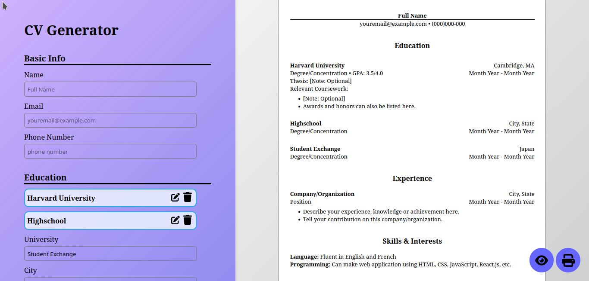
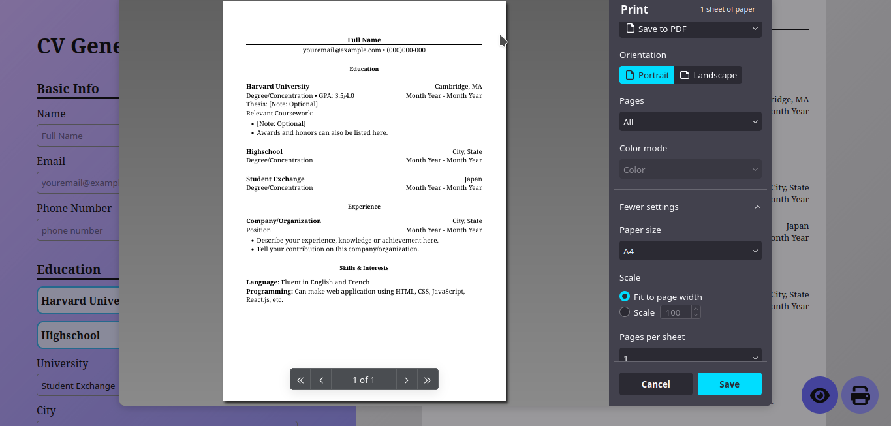

# CV Generator

CV Generator is a web application that allow users to create their CV easily. Fill the form and the CV will be dynamically updated.

For now there's only one CV template (Harvard), but there will be more CV template in the future.

## Ingredients

- Vite + React.js
- CSS
- Font Awesome Icons

[Check live preview of this project here!](https://shiielty.github.io/cv-project)

## Screenshot

